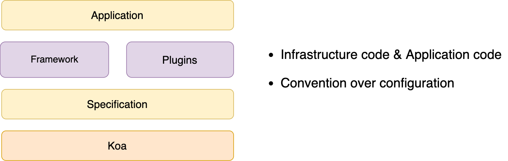

# How to build a serverless platform

<!-- first formal presentation using english, joke my broken english  -->
<!-- ask the serverless question, no need to care about the running details of server -->

---

# About me

- Lele(Ben) Liu
- Joined Fergus on Sep 2019
- Worked in China for 7 years
- Building ideas with JS and Node.js
- Now working on RN App in mobile team

<!-- any questions -->

---

## Background

- Team structure and tech stack
- Node.js projects and scale problems

<!-- Client/Backend department, Java/VM/Docker -->
<!-- availability/security/scale, 120 projects, quite a lot of VM resources -->

---

# Runtime framework

---

# Container

---

# Gateway

<!-- canary/blue-green/AB test deployment policy -->
<!-- - reverse proxy -->
<!-- - Load balance -->

---

# Process management

---

# Overall architecture

<!-- A typical development process -->

<!-- - One runtime framework for structuring an App
- Local CLI development tools to create/debug/test/publish the App
-  -->
<!--
- Observability — via built-in logging, tracing, monitoring, alerting and error classification.
- Modularity — An opinionated framework for structuring a service and enabling both compile-time and run-time modularity.
- Productivity — Local development tools including code generators run tests and debug, and a command line interface.
- Delivery — A fully-managed continuous-delivery system of pipelines, continuous integration jobs, and end to end tests. When you merge your pull request, it makes it to production without manual intervention. -->

---

# Highlights of what I learned

---

# Design first

- Feasibility design to achieve the business goal
- Apply for all tech solutions

<!-- A typical practice -->

---

# Build for future

- Build for long-term

---

# Platform mindset

- Consistency and systematic approach
- Let developers focus more on business and less time on infrastructure

<!-- Mindset shift from large application to platform plus application -->
<!-- developer has to give up a certain amount of flexibility in exchange for consistency and reliability -->

---

# Q & A

## Thanks for your time
